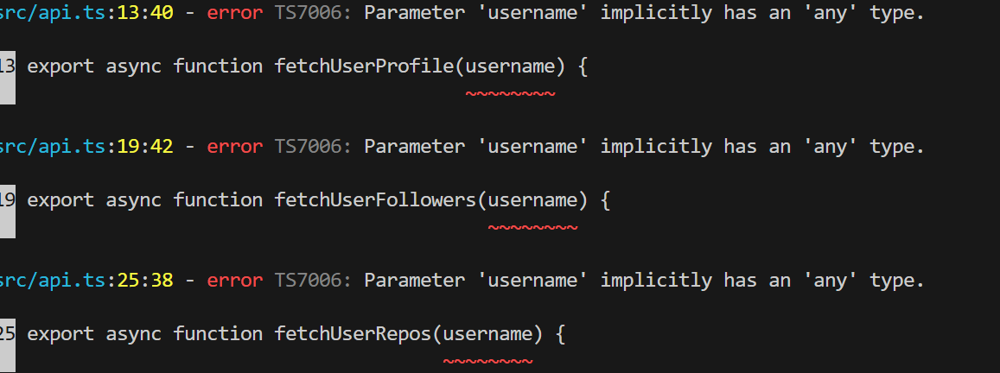
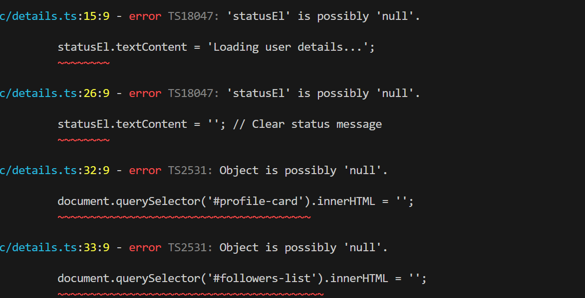
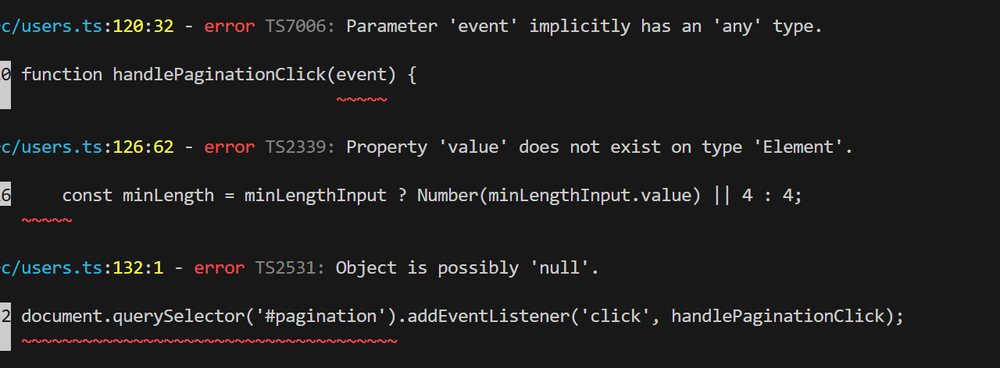

# GitHub Users Explorer (TypeScript Migration)

A responsive single-page web application to search, filter, and explore GitHub users and detailed profile statistics, migrated from JavaScript to TypeScript.

---

## 🛠️ Setup & Running Instructions

1. **Clone the Repository**:
   ```bash
   git clone <repository-url>
   cd github-user-explorer
   ```

2. **Install Dependencies**:
   ```bash
   npm install
   ```

3. **Compile TypeScript**:
   Run the TypeScript compiler to build `.ts` source files from `src/` into output `.js` files in `dist/`:
   ```bash
   npx tsc
   ```

4. **Serve the Application**:
   Open the root directory using any local web server:
   - **VS Code**: Right-click `index.html` → **Open with Live Server**.
   - **Node.js**:
     ```bash
     npx serve .
     ```
   Then open `http://localhost:3000` (or the port provided by your server).

---

## ⚙️ TypeScript Configuration (`tsconfig.json`)

The project uses `tsconfig.json` to control how TypeScript checks and compiles our code:

```json
{
  "compilerOptions": {
    "target": "ES2020",
    "module": "ESNext",
    "rootDir": "./src",
    "outDir": "./dist",
    "strict": true,
    "noImplicitAny": true,
    "esModuleInterop": true,
    "skipLibCheck": true
  },
  "include": ["src/**/*"]
}
```

### Key Settings Explained:
- **`rootDir: "./src"`**: Tells TypeScript where all our source `.ts` files live.
- **`outDir: "./dist"`**: Tells TypeScript where to save the generated `.js` files after compilation.
- **`strict: true`**: Turns on all strict type-checking flags to catch potential runtime bugs at build time.
- **`noImplicitAny: true`**: Prevents variables or parameters from defaulting to `any` if their type isn't specified.

---

## 📂 Project Structure

```text
github-user-explorer/
├── dist/                  # Generated JavaScript files (output from tsc)
│   ├── api.js
│   ├── details.js
│   ├── ui.js
│   └── users.js
├── src/                   # TypeScript source code
│   ├── api.ts             # Typed ApiService class & singleton instance
│   ├── details.ts         # User details controller
│   ├── types.ts           # Centralized TypeScript interfaces & Utility types
│   ├── ui.ts              # Strongly-typed DOM rendering module
│   └── users.ts           # Users dashboard controller & state manager
├── screenshots/           # Application & compiler output screenshots
│   └── .gitkeep
├── css/
│   └── styles.css
├── index.html             # Main list view (loads ./dist/users.js)
├── details.html           # User details view (loads ./dist/details.js)
├── tsconfig.json          # TypeScript compiler configuration
├── package.json           # Node project configuration
└── README.md
```

---

## 📌 Task 1: Project Setup & TS Migration Insights

When running `npx tsc` for the first time with `strict: true` and `noImplicitAny: true`, TypeScript pointed out **74 errors** across our JavaScript files. Here is what we learned from them:

### Initial Compiler Run Overview
When `npx tsc` was executed, the compiler evaluated all source files against strict typing rules and flagged missing type annotations, unsafe null accesses, and invalid DOM property accesses.

---

### 1. Implicit `any` Types (`TS7006`)
- **Problem:** Parameters like `username` in `fetchUserProfile(username)` had no specified type.
- **Why it matters:** JavaScript allows passing anything, but TypeScript requires us to explicitly state expected types (e.g. `username: string`).



---

### 2. Possible `null` Values (`TS18047` / `TS2531`)
- **Problem:** DOM selections like `document.querySelector('#users-container')` might return `null` if the element isn't in the HTML.
- **Why it matters:** Accessing `.innerHTML` on `null` crashes the app. TypeScript forces us to add null safety checks (`if (container) ...` or optional chaining `?.`).



---

### 3. Specific DOM Element Types (`TS2339`)
- **Problem:** `document.querySelector('#min-login-length')` returns a generic `Element`, which does not have a `.value` property.
- **Why it matters:** Only `HTMLInputElement` has `.value`. We must cast DOM elements to their specific HTML types (e.g. `as HTMLInputElement`).



---

## 📌 Task 2: Data Interfaces & Types

All API response shapes are centralized inside `src/types.ts` to ensure type safety across the entire application:

### Interfaces Overview:
- **`GitHubUser`**: Represents a user profile object returned by GitHub API (`/users` and `/users/{username}`). Includes nullable/optional fields like `name`, `bio`, and `followers`.
- **`GitHubFollower`**: Represents a follower summary object (`login`, `id`, `avatar_url`, `html_url`).
- **`GitHubRepo`**: Represents a repository summary object (`name`, `stargazers_count`, `description`, etc.).
- **`TransformedUser`**: Represents the simplified user object used by the user card UI.

```typescript
export interface GitHubUser {
    login: string;
    id: number;
    avatar_url: string;
    html_url: string;
    name?: string | null;
    public_repos?: number;
    followers?: number;
    following?: number;
    bio?: string | null;
}
```

---

## 📌 Task 3: Generic API Helper (`httpGet<T>`)

To eliminate code duplication across API calls, we implemented a generic API helper function `httpGet<T>` inside `src/api.ts`.

*(Note: The example below shows how `fetchUsers()` was refactored. The exact same generic helper pattern was applied to `fetchUserProfile()`, `fetchUserFollowers()`, and `fetchUserRepos()`)*

### Before vs After Refactoring:

#### 1. Before (Plain JS — Repetitive Error Handling & Untyped):
```javascript
export async function fetchUsers() {
    const response = await fetch(`${BASE_URL}/users`);
    if (!response.ok) {
        throw new Error(`Failed to fetch users (Status: ${response.status})`);
    }
    return await response.json();
}
```

#### 2. Generic Helper Definition (`httpGet<T>`):
```typescript
export async function httpGet<T>(url: string): Promise<T> {
    const response = await fetch(url);
    if (!response.ok) {
        throw new Error(`HTTP error! Status: ${response.status}`);
    }
    const data: T = await response.json();
    return data;
}
```

---

## 📌 Task 4: Typed Success and Error Results (Union Types)

To avoid uncaught runtime exceptions when network requests fail, we evolved `httpGet<T>` into a safe result pattern using a **Discriminated Union Type** `ApiResult<T>` defined in `src/types.ts`:

```typescript
export type ApiResult<T> =
    | { success: true; data: T }
    | { success: false; error: string };
```

### Evolution: `httpGet<T>` vs `safeHttpGet<T>`

#### 1. Earlier Helper (`httpGet` — Threw Raw Errors):
```typescript
export async function httpGet<T>(url: string): Promise<T> {
    const response = await fetch(url);
    if (!response.ok) throw new Error(`HTTP error! Status: ${response.status}`);
    return await response.json();
}
```

#### 2. Updated Helper (`safeHttpGet` — Returns Typed Union Result):
```typescript
export async function safeHttpGet<T>(url: string): Promise<ApiResult<T>> {
    try {
        const response = await fetch(url);
        if (!response.ok) {
            return { success: false, error: `HTTP error! Status: ${response.status}` };
        }
        const data: T = await response.json();
        return { success: true, data };
    } catch (err) {
        const errorMessage = err instanceof Error ? err.message : 'An unexpected network error occurred';
        return { success: false, error: errorMessage };
    }
}
```

### Application Logic Migration (`src/users.ts` & `src/details.ts`):

#### 1. Old Application Code (Broken when `ApiResult` introduced):
Previously, callers assumed `fetchUsers()` returned a raw array directly:
```typescript
const rawUsers = await fetchUsers();
allUsers = transformUsers(rawUsers); // Called rawUsers.map() directly
```
*Why this broke:* Once `fetchUsers()` started returning `{ success: true, data: [...] }`, `rawUsers` became an **object**, not an array. Calling `rawUsers.map()` threw `rawUsers.map is not a function`.

#### 2. New Application Code (Safe `ApiResult` Handling in `src/users.ts`):
Callers now check `result.success` before extracting `result.data`:
```typescript
const result = await fetchUsers();

if (!result.success) {
    renderStatus(`Could not load users: ${result.error}`);
    return;
}

// TypeScript type-narrows result.data to GitHubUser[] array
allUsers = transformUsers(result.data);
```

#### 3. Parallel API Fetching & Type Narrowing (`src/details.ts`):
Similarly, `src/details.ts` was updated to unpack `ApiResult` objects returned by parallel `Promise.all` requests (`fetchUserProfile`, `fetchUserFollowers`, `fetchUserRepos`):

```typescript
const [profileRes, followersRes, reposRes] = await Promise.all([
    fetchUserProfile(username),
    fetchUserFollowers(username),
    fetchUserRepos(username)
]);

if (profileRes.success) {
    renderProfile(profileRes.data);
}

if (followersRes.success) {
    renderFollowers(followersRes.data);
} else {
    renderFollowers([]);
}

if (reposRes.success) {
    renderRepos(reposRes.data);
} else {
    renderRepos([]);
}
```

---

## 📌 Task 5: Typed `ApiService` Class

To transition from procedural standalone functions to Object-Oriented Architecture, all API logic was refactored into an `ApiService` class inside `src/api.ts`.

### Before vs After Refactoring:

#### 1. Before (Task 4 Standalone Exported Functions):
```typescript
export async function fetchUsers(): Promise<ApiResult<GitHubUser[]>> {
    return await safeHttpGet<GitHubUser[]>(`${BASE_URL}/users`);
}
```

#### 2. After (Task 5 Encapsulated `ApiService` Class):
```typescript
import { GitHubUser, GitHubFollower, GitHubRepo, ApiResult } from './types.js';

export class ApiService {
    // 1. Encapsulated State
    private baseUrl: string;

    // 2. Dependency Injection Constructor
    constructor(baseUrl: string = 'https://api.github.com') {
        this.baseUrl = baseUrl;
    }

    // 3. Encapsulated Private Generic Request Engine
    private async request<T>(endpoint: string): Promise<ApiResult<T>> {
        try {
            const response = await fetch(`${this.baseUrl}${endpoint}`);
            if (!response.ok) {
                return { success: false, error: `HTTP error! Status: ${response.status}` };
            }
            const data: T = await response.json();
            return { success: true, data };
        } catch (err) {
            const errorMessage = err instanceof Error ? err.message : 'An unexpected network error occurred';
            return { success: false, error: errorMessage };
        }
    }

    // 4. Public Service Proxy Methods
    public async getUsers(): Promise<ApiResult<GitHubUser[]>> {
        return this.request<GitHubUser[]>('/users');
    }

    public async getUserProfile(username: string): Promise<ApiResult<GitHubUser>> {
        return this.request<GitHubUser>(`/users/${username}`);
    }

    public async getUserFollowers(username: string): Promise<ApiResult<GitHubFollower[]>> {
        return this.request<GitHubFollower[]>(`/users/${username}/followers?per_page=5`);
    }

    public async getUserRepos(username: string): Promise<ApiResult<GitHubRepo[]>> {
        return this.request<GitHubRepo[]>(`/users/${username}/repos?per_page=5`);
    }
}

// 5. Singleton Export
export const apiService = new ApiService();
```

### Key Architectural Concepts Applied:

1. **Encapsulation (`private` visibility):**
   - `private baseUrl` and `private request<T>()` hide raw HTTP fetching logic behind the class boundary.
   - Outside code in `users.ts` or `details.ts` cannot access `private request`, forcing all callers to use safe public methods (`getUsers()`, `getUserProfile()`).

2. **Dependency Injection (`constructor`):**
   - `constructor(baseUrl: string = 'https://api.github.com')` allows passing alternative API URLs for staging, testing, or mock servers (`new ApiService('http://localhost:4000')`) without modifying class internals.

3. **Singleton Pattern (`export const apiService`):**
   - Exporting a single instance `apiService = new ApiService()` ensures that all application controllers (`src/users.ts` and `src/details.ts`) share the exact same instantiated service object in memory.

### Application Usage Migration:
- **In `src/users.ts`:**
  ```typescript
  import { apiService } from './api.js';
  const result = await apiService.getUsers();
  ```
- **In `src/details.ts`:**
  ```typescript
  import { apiService } from './api.js';
  const [profileRes, followersRes, reposRes] = await Promise.all([
      apiService.getUserProfile(username),
      apiService.getUserFollowers(username),
      apiService.getUserRepos(username)
  ]);
  ```

---

## 📌 Task 6: Typed DOM Elements, Application State & Event Handlers

In Task 6, we eliminated all implicit `any` types and unsafe DOM property accesses across `src/ui.ts` and `src/users.ts`.

### 1. Specific DOM Element Type Assertions
Instead of working with generic `Element` return types, DOM selections are cast to their specific HTML interfaces:
- **`HTMLInputElement`**: Enables safe access to `.value` (e.g. `document.querySelector('#min-login-length') as HTMLInputElement`).
- **`HTMLTemplateElement`**: Enables access to `.content` (e.g. `document.querySelector('#user-card-template') as HTMLTemplateElement`).
- **`HTMLImageElement` & `HTMLAnchorElement`**: Enables typed access to `.src`, `.alt`, `.href`.

### 2. Strict Null Safety & Type Guards
Every DOM query is guarded with null safety checks before property dereferencing:
```typescript
const container = document.querySelector('#users-container');
const template = document.querySelector('#user-card-template') as HTMLTemplateElement | null;

if (!container || !template) return; // Null guard prevents runtime crashes
```

### 3. Application State Typing (`src/users.ts`)
All global state variables were given explicit type annotations:
```typescript
let allUsers: TransformedUser[] = [];
let displayedUsers: TransformedUser[] = [];
let currentPage: number = 1;
const pageSize: number = 9;
```

### 4. Typed Event Handlers
Event listener callbacks and event targets are explicitly typed:
```typescript
function handlePaginationClick(event: Event): void {
    const target = event.target as HTMLElement | null;
    if (!target) return;

    const targetPage = target.dataset.page;
    if (!targetPage) return;

    currentPage = Number(targetPage);
}
```


## 📌 Task 7: Use Utility Types and Transform API Data

Instead of manually duplicating properties across interfaces, we refactored [src/types.ts](file:///c:/CustomApps/github-user-explorer/src/types.ts) using TypeScript's built-in **Utility Types** (`Pick`).

### Before vs After Refactoring:

*(Note: Below is an example showing how `GitHubFollower` was refactored using `Pick`.)*

#### 1. Before (Manual Interface Duplication):
```typescript
// Duplicate manual property declarations
export interface GitHubFollower {
    login: string;
    id: number;
    avatar_url: string;
    html_url: string;
}
```

#### 2. After (Derived using `Pick` Utility Type):
```typescript
// Derived directly from master GitHubUser interface using Pick:
export type GitHubFollower = Pick<GitHubUser, 'login' | 'id' | 'avatar_url' | 'html_url'>;

```

---

## 📌 Task 8: User Details with Parallel API Requests (`Promise.all` vs `Promise.allSettled`)

In `src/details.ts`, we implemented an industry-standard **2-Stage Parent-Child Architecture** for loading user details:

### 1. Architectural Design Flow:

```text
[ Stage 1: Validate Parent Entity ]
      │
      ▼
Fetch User Profile ──> (404 Not Found?) ──> STOP! Display "User Profile Not Found".
      │
      │ (Success: User Profile Exists!)
      ▼
[ Stage 2: Concurrent Child Execution ]
      ├── Fetch Followers  ┐
      └── Fetch Repos      ┴──> Executed in parallel via Promise.allSettled
```

### 2. Implementation (`src/details.ts`):

```typescript
// STAGE 1: Validate Parent User Profile First
const profileRes = await apiService.getUserProfile(username);

if (!profileRes.success) {
    // If parent user does not exist (404), stop immediately & display clean message
    renderProfileError(`User profile for "@${username}" was not found.`);
    return;
}

renderProfile(profileRes.data);

// STAGE 2: User exists! Fetch Followers and Repos concurrently using Promise.allSettled
const [followersSettled, reposSettled] = await Promise.allSettled([
    apiService.getUserFollowers(username),
    apiService.getUserRepos(username)
]);
```

### 3. Decision & Technical Justification (`Promise.all` vs `Promise.allSettled`):

| Feature | `Promise.all` | `Promise.allSettled` |
| :--- | :--- | :--- |
| **Failure Behavior** | Short-circuits immediately if any promise rejects. | Never short-circuits; waits for all promises to settle regardless of failure. |
| **Result Format** | Array of raw values `[T1, T2]`. | Array of status objects `[{ status: 'fulfilled', value }, { status: 'rejected', reason }]`. |

#### Why `Promise.allSettled` was selected for Stage 2:
1. **Rate Limit & Performance Protection:** Stage 1 verifies the parent profile exists first, avoiding 3 wasted API calls when a user doesn't exist (404).
2. **Partial Failure Isolation:** In Stage 2, `Promise.allSettled` handles Followers and Repos concurrently. If fetching Followers fails due to a network glitch or rate limit (`followersSettled.status === 'rejected'` or `followersRes.success === false`), a friendly *"Unable to load followers at this time"* message is displayed while the Repositories section still renders cleanly!

---

## 📌 Task 9: Improve Loading and Error Handling

In Task 9, we updated application error propagation and UI loading state cleanup across `src/users.ts` and `src/details.ts`.

### Concise Enhancements Made:

1. **Guaranteed Status Cleanup (`finally` Block):**
   In `src/details.ts`, status text cleanup (`statusEl.textContent = ''`) is wrapped inside a `finally` block to ensure `"Loading user details..."` is ALWAYS cleared when fetching completes, regardless of success, 404, or network error.

2. **Developer Diagnostics (`console.error`):**
   Added explicit `console.error()` logging on API failures to prevent errors from swallowing silently while keeping UI error messages friendly and non-technical.

---

## 📌 Task 10: Use Composition Instead of Inheritance

Instead of rigid class inheritance (`extends`), the application architecture is built using **Object Composition** and the **Single Responsibility Principle (SRP)**.

### Module Responsibilities Breakdown:

1. **API Service (`src/api.ts`):** Handles HTTP network fetching, `baseUrl` configuration, and returning `ApiResult<T>`. Contains zero DOM or HTML logic.
2. **UI & Formatting Module (`src/ui.ts`):** Handles DOM selections, card template cloning, and status rendering. Contains zero network or `fetch` logic.
3. **Application Controllers (`src/users.ts` & `src/details.ts`):** Composes `apiService` and `ui` rendering functions together to orchestrate page state and application flow.

### Architectural Benefits of Composition:
- **Loose Coupling:** Modifying API endpoints or network logic in `src/api.ts` has zero ripple effect on DOM rendering functions in `src/ui.ts`.
- **Flexible Dependency Injection:** The `ApiService` constructor allows injecting custom API base URLs (e.g. for mock or staging servers) without altering application or UI logic.

---

